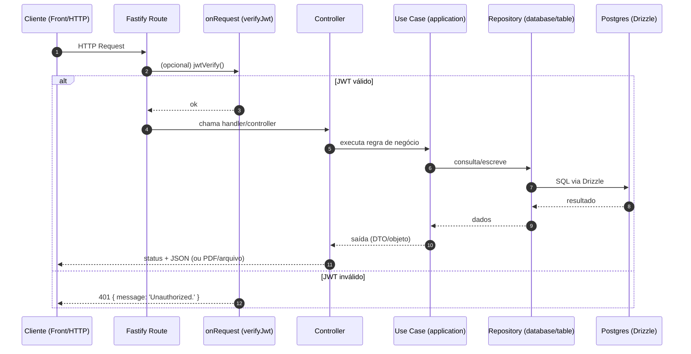

# Back-end — Arquitetura e Contratos

## Sumário

- [1. Visão geral](#1-visão-geral)
- [2. Stack e bibliotecas](#2-stack-e-bibliotecas)
- [3. Organização de pastas](#3-organização-de-pastas)
- [4. Fluxo de request (rota → controller → use case → repository → DB)](#4-fluxo-de-request-rota--controller--use-case--repository--db)
- [5. Autenticação e autorização (JWT)](#5-autenticação-e-autorização-jwt)
- [6. Swagger/OpenAPI](#6-swaggeropenapi)
- [7. Validação e tipagem com Zod](#7-validação-e-tipagem-com-zod)
- [8. Jobs agendados (cron) e impacto operacional](#8-jobs-agendados-cron-e-impacto-operacional)
- [9. Padrões atuais de erro/resposta (e recomendação de padronização)](#9-padrões-atuais-de-errorresposta-e-recomendação-de-padronização)
- [Assumptions & Gaps](#assumptions--gaps)

## 1. Visão geral

O back-end é um serviço **Fastify** com TypeScript (ESM) que expõe endpoints REST por módulos (usuários, tarefas, atividades, feedback, mídia, grupos/presença, análises mensais e kanban). A API usa **JWT** e valida/serializa payloads com **Zod** via `fastify-type-provider-zod`.

- **Entrada do servidor**: `Back/src/server.ts`
- **Composição do app**: `Back/src/app.ts`
- **Documentação Swagger UI**: `GET /docs` (configurado em `Back/src/app.ts`)

## 2. Stack e bibliotecas

Derivado de `Back/package.json`:

- **Runtime**: Node.js (ESM), TypeScript (`--experimental-strip-types` no `start`)
- **Framework HTTP**: `fastify`
- **Auth**: `@fastify/jwt`, `@fastify/cookie`
- **CORS**: `@fastify/cors`
- **Uploads/arquivos**: `@fastify/multipart`, `@fastify/static` (servindo `/uploads/`)
- **OpenAPI**: `@fastify/swagger`, `@fastify/swagger-ui`
- **ORM/migrations**: `drizzle-orm`, `drizzle-kit`, `pg`/`postgres`
- **Validação**: `zod`, `fastify-type-provider-zod`
- **Jobs**: `node-cron`
- **PDF**: `pdfmake`

## 3. Organização de pastas

Estrutura observada (principais):

- `Back/src/app.ts`: registra plugins (JWT/CORS/Swagger/etc.) e routers por domínio
- `Back/src/server.ts`: sobe o servidor e porta via `env.PORT`
- `Back/src/controller/**`: controllers + definição de rotas (um `routes.ts` por módulo)
- `Back/src/application/**`: regras de negócio (use cases), entidades e fábricas
- `Back/src/database/drizzle/**`: schema Drizzle (tabelas, enums)
- `Back/src/database/table/**`: repositories Drizzle (persistência por agregado/módulo)
- `Back/src/lib/**`: utilitários transversais (ex.: `verify-jwt.ts`, `env.ts`)
- `Back/drizzle/**`: artefatos de migração gerados pelo drizzle-kit

## 4. Fluxo de request (rota → controller → use case → repository → DB)

### 4.1 Diagrama (Mermaid)

### 4.2 Exemplo de roteamento modular

Em `Back/src/app.ts`, os módulos são registrados com prefixos:

- `/user` → `Back/src/controller/user/routes.ts`
- `/tarefas` → `Back/src/controller/tarefas/routes.ts`
- `/atividade` → `Back/src/controller/atividade/routes.ts`
- `/feedback` → `Back/src/controller/feedback/routes.ts`
- `/media` → `Back/src/controller/media/routes.ts`
- `/grupos` → `Back/src/controller/grupos/routes.ts`
- `/analise` → `Back/src/controller/analiseMensal/route.ts`
- `/kanban` → `Back/src/controller/kanban/route.ts`

## 5. Autenticação e autorização (JWT)

### 5.1 Emissão do token (login)

- Endpoint: `POST /user/auth` (`Back/src/controller/user/routes.ts`)
- Controller: `Back/src/controller/user/authenticate.ts`
- O token é assinado com:
  - `sub`: `user.id`
  - claims: `name`, `matricula`, `role`
  - expiração: `4h`
  - também é setado um cookie `refreshToken` (mesmo token, `httpOnly`)

### 5.2 Verificação do token (guard)

O middleware `verifyJwt` (`Back/src/lib/verify-jwt.ts`) chama `request.jwtVerify()` e responde:

- **401** com `{ message: 'Unauthorized.' }` em caso de falha

### 5.3 Autorização (papéis/roles)

O sistema possui enum de roles (`Back/src/database/drizzle/roles.ts`) e tabela `user_roles` (`Back/src/database/drizzle/user_roles.ts`).

**Observação importante**: a maioria das rotas aplica apenas `verifyJwt` (autenticação). Regras de autorização por role parecem ocorrer principalmente no front (ex.: permitir atualização de status de feedback só para `INFORMATICA`). Recomenda-se centralizar autorização no back-end (ver seção 9).

## 6. Swagger/OpenAPI

Configuração em `Back/src/app.ts`:

- `@fastify/swagger` com `openapi.info` e `securitySchemes.bearerAuth`
- `transform: jsonSchemaTransform` para converter schemas Zod em JSON Schema
- `@fastify/swagger-ui` em `routePrefix: '/docs'`

Isso permite que os endpoints anotados com `schema` (tags, summary, body/params/response) sejam documentados automaticamente.

## 7. Validação e tipagem com Zod

Padrão observado nas rotas:

- `app.withTypeProvider<ZodTypeProvider>()...`
- Definição de `schema.body`, `schema.params` e, em alguns casos, `schema.response`
- Controllers também fazem `z.object(...).parse(request.body)` em alguns pontos (validação dupla em alguns endpoints)

## 8. Jobs agendados (cron) e impacto operacional

Jobs registrados por import side-effect em `Back/src/app.ts`:

- `Back/src/application/useCase/grupos/function/criaPresencaJob.ts`
  - Agenda: `06:30` (cron `30 06 * * *`) `America/Sao_Paulo`
  - Ação: gera presenças do dia
- `Back/src/application/useCase/grupos/function/fechaPresencaJob.ts`
  - Agenda: `17:20` (cron `20 17 * * *`) `America/Sao_Paulo`
  - Ação: fecha presenças pendentes do dia

**Impacto operacional**:

- O processo do back-end precisa estar executando continuamente para os jobs rodarem.
- Logs de execução são via `console.log` (“Job executado com sucesso”).
- Se houver reinício/falha no horário, o job pode não executar (não há mecanismo visível de retry/backfill).

## 9. Padrões atuais de erro/resposta (e recomendação de padronização)

### 9.1 Padrão atual (observado)

Há variações entre controllers:

- `verifyJwt` sempre devolve `{ message: 'Unauthorized.' }` com **401**.
- `POST /user/auth` retorna **token como string** no corpo (apesar de swagger sugerir `{ token: string }`).
- Alguns controllers retornam string direta em erro (ex.: `createTarefasController` retorna `reply.status(400).send(err.message)`).
- Outros retornam objeto `{ message }` (ex.: login retorna `{ message }` em 400 para erros específicos).
- Em alguns pontos há uso de status não padrão (ex.: **501** em erro genérico de criação de tarefas).

### 9.2 Recomendações (futuras)

Padronizar resposta de erro em JSON e códigos HTTP:

- Estrutura sugerida:
  - `{ message: string, code?: string, details?: unknown }`
- Usar:
  - 400 para validação/regra de negócio
  - 401/403 para auth/authz
  - 404 para recurso inexistente
  - 409 para conflito (ex.: duplicidade)
  - 500 para erro inesperado

E alinhar schemas Swagger com o payload real (ex.: `/user/auth`).

## Assumptions & Gaps

- Existe divergência entre alguns `schema.response` das rotas e o payload real retornado em controllers (ex.: `/user/auth` retorna string).
- A autorização por `role` não está claramente implementada no back-end; a documentação assume o comportamento que o front aplica (sujeito a revisão).
