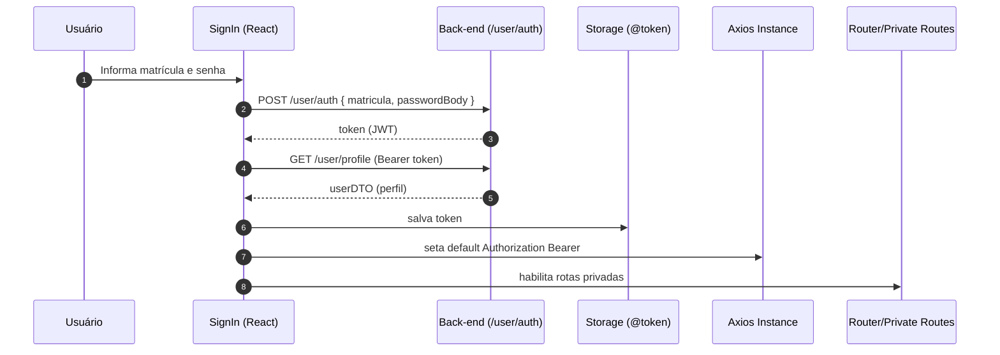

# Front-end — Arquitetura e Padrões

## Sumário

- [1. Visão geral](#1-visão-geral)
- [2. Stack e bibliotecas](#2-stack-e-bibliotecas)
- [3. Estrutura do projeto (pastas principais)](#3-estrutura-do-projeto-pastas-principais)
- [4. Roteamento e proteção de rotas](#4-roteamento-e-proteção-de-rotas)
- [5. Fluxo de autenticação (JWT)](#5-fluxo-de-autenticação-jwt)
- [6. Estado remoto/local (React Query + storage/context)](#6-estado-remotolocal-react-query--storagecontext)
- [7. Cliente HTTP e tratamento de erros](#7-cliente-http-e-tratamento-de-erros)
- [8. UI e componentes reutilizáveis](#8-ui-e-componentes-reutilizáveis)
- [9. Padrões de formulário e validação](#9-padrões-de-formulário-e-validação)
- [Assumptions & Gaps](#assumptions--gaps)

## 1. Visão geral

O front-end é uma SPA em **React + Vite** que consome a API do SisTarefas. O acesso é protegido por token (JWT) armazenado no storage e propagado no header `Authorization: Bearer <token>`.

Rotas e páginas principais:

- Autenticação: `Front/src/pages/auth/sign-in.tsx`
- App (privado): `Front/src/pages/layout/AppLayout.tsx` e páginas em `Front/src/pages/app/*`

## 2. Stack e bibliotecas

Derivado de `Front/package.json`:

- **Framework**: React 19
- **Build**: Vite
- **Roteamento**: `react-router`
- **Estado remoto**: `@tanstack/react-query`
- **Formulários**: `react-hook-form` + `@hookform/resolvers` + `zod`
- **UI**: TailwindCSS + Radix UI + componentes no estilo shadcn (`Front/src/components/ui/*`)
- **HTTP**: Axios (`Front/src/lib/axios.ts`)
- **D&D**: `@dnd-kit/core` (Kanban)

## 3. Estrutura do projeto (pastas principais)

Padrão observado em `Front/src`:

- `pages/`
  - `pages/rotes.tsx`: definição das rotas e proteção por token
  - `pages/auth/*`: telas públicas
  - `pages/app/*`: telas privadas por módulo
  - `pages/layout/*`: layout autenticado
- `components/`: componentes do domínio (ex.: `TabelaAtividades`, `CriarKanban`, etc.)
- `components/ui/`: primitives e UI reutilizável (Radix + Tailwind)
- `api/`: funções de consumo de endpoints (ex.: `findGrupos`, `totalTarefas`, etc.)
- `context/`: `authContext` (sessão/token)
- `hooks/`: `useAuth`
- `lib/`: `axios`, `env`, `react-query`, `appErrors`, `utils`
- `dtos/`: contratos de dados usados no front (tipos)
- `stora/`: storage do token (`storaAuth`)

## 4. Roteamento e proteção de rotas

O arquivo `Front/src/pages/rotes.tsx` define:

- Sem token: usuário é redirecionado para `/auth`
- Com token: monta `AppLayout` e habilita páginas privadas (Atividades, Dashboard, Kanban etc.)

**Páginas privadas mapeadas**:

- `/` → `Atividades`
- `/dash` → `Dashboard`
- `/feedback` → `FeedbackRelatorio`
- `/gerenciargrupo` → `GerenciarGrupos`
- `/gerenciarpresenca` → `GerenciaPresenca`
- `/consultar` → `ConsultarPresenca`
- `/analise` → `AnaliseMensal`
- `/analises` → `AnalisesMensais`
- `/kanban` → `Kanban`
- `/video` → `Video`

## 5. Fluxo de autenticação (JWT)

### 5.1 Diagrama (Mermaid)

### 5.2 Implementação (pontos-chave)

- `AuthContext` (`Front/src/context/authContext.tsx`)
  - `signIg`: autentica, salva token e carrega perfil
  - `loadUser`: tenta restaurar token do storage e chama `/user/profile`
  - `signOut`: remove token e recarrega a página
- Storage:
  - `Front/src/stora/storaAuth.ts` (não documentado aqui em detalhe; usado pelo context)
- Rotas:
  - `Front/src/pages/rotes.tsx` verifica `token` e bloqueia navegação sem autenticação

## 6. Estado remoto/local (React Query + storage/context)

- **Local**:
  - Token e usuário em `AuthContext`
  - Estados de UI local em páginas/componentes (ex.: filtros, modais)
- **Remoto (server state)**:
  - `useQuery` e `useMutation` com `invalidateQueries` em ações que alteram dados
  - Ex.: Kanban invalida `["kanban"]` após transições de status (`Front/src/pages/app/Kanban.tsx`)

## 7. Cliente HTTP e tratamento de erros

`Front/src/lib/axios.ts`:

- `baseURL` vindo de `Front/src/lib/env.ts` (`VITE_API_URL`)
- Interceptor opcional para simular latência (`VITE_ENABLE_API_DELAY`)
- Interceptor de resposta:
  - dispara `signOut()` quando status é 401/404 com message `'Unauthorized.'` ou `'invalid'`
  - converte erro de API em `AppErrors` com `message`

## 8. UI e componentes reutilizáveis

Padrões observados:

- Componentes UI (Radix + Tailwind): `Front/src/components/ui/*`
- Páginas usam componentes compostos (ex.: tabelas, dialogs e formulários)
- Kanban usa `@dnd-kit/core` com movimento otimista (atualiza cache React Query antes de confirmar no servidor)

## 9. Padrões de formulário e validação

Padrão recorrente:

- `zod` para schema
- `react-hook-form` com `zodResolver`
- Ex.: Login (`Front/src/pages/auth/sign-in.tsx`), filtros de presença (`GerenciaPresenca.tsx`) e consulta de análises (`AnalisesMensais.tsx`)

## Assumptions & Gaps

- O front aplica algumas regras de permissão por role (ex.: ações de gestão e atualização de status). Isso **não substitui** autorização server-side; documentamos como comportamento de UI.
- Existem chamadas a endpoints em componentes/páginas além de `Front/src/api/*` (ex.: `api.get("/atividade/list")` direto em `Dashboard`). A documentação de endpoints considera ambos os caminhos.
